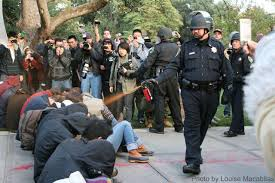
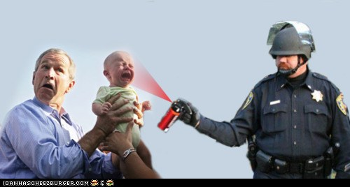

**Internet Memes: Weapons of Mass Disruption**

The 2016 presidential election is ripe with opportunity for people to
poke fun at candidates. Twitter, Tumblr, and Facebook are full of young
people making fun of Clinton’s failed attempts at connecting with youth
and of Trump’s gravity-defying hair. These widely and rapidly spread
jokes, pictures, and videos are all examples of Internet memes. Memes
tell a story about what is happening in the world at a particular time;
they act as a time capsule for a brief period of history. Michael
Phelps’s angry pre-race face was a meme representation of the 2016
Olympics in Rio. Popular among young people, Internet memes offer a
twenty first century method of social commentary, particularly in
relation to politics. The purpose of this essay is to understand how
Internet memes have the capacity to influence people in a way that
disrupts normal political socialization.

To understand how memes can effect socialization, one must first
understand how important memes have been in Internet culture. Richard
Dawkins, an evolutionary biologist, coined the term “meme” in 1985 in
reference to a piece of culture or behavior that spreads quickly and
effectively through society by non-genetic means (Levinson, 2012).
Dawkins likened the way that cultural items are spread through society
to the way genes are biologically passed down (Solon, 2013). Cultural
items such as speech are imitated and copied by members of a society,
changing slightly from person to person. Websites like Tumblr, Facebook,
and Twitter allow people to identify and share cultural items (videos,
photos, etc.) while providing their own commentary on what they’re
sharing. Internet memes are a subcategory of memes that are effectively
studied because they are easily identifiable, and thus, more easily
studied. A strong definition of the concept of the Internet meme is “an
image, recreation, catchphrase, or other piece of media that circulates
throughout the population as different people mimic its form” (Lawson,
et al., 2016).

By distinguishing Internet memes as a subcategory of a broader genre of
communication, we can study how Internet memes give young people a voice
in the political world. Traditionally, there was a distinct divide
between the sender of a message and the audience that receives the
message (Creoteau, Hoynes, pg 8). In *Media/Society: Industries, Images,
and Audiences,* David Croteau and William Hoynes cite the Internet as
the driving force that led audiences to be users of media, too (pg 8).
Through social media, people can share their beliefs to a great number
of people. In this way, the sender and audience of media are one and the
same. Internet memes capitalize on participatory culture, since they
must be both consumed and shared in order to spread and become
understood by everyone in a particular culture. Memes provide social
commentary, and in the case of political memes, act as a modern version
of political satire.

This logic allows Internet memes to be applied to socialization. Croteau
and Hoynes define socialization as “the process whereby we learn and
internalize the values, beliefs, and norms of our culture, and, in so
doing, develop a sense of self” (pg 16). Parents are generally perceived
as having the most power over the socialization of their children
because they are their primary caregivers. However, in modern times, the
Internet has a powerful role in shaping the self. Since access to the
Internet is widespread and cross-cultural, what we define as our
“culture” is broader than what was usual in the past. Memes have the
capacity to disrupt “normal” (at least, normal in the past)
socialization by presenting us with opinions that differ from those we
are generally surrounded by. For example, if you identified strongly
with the culture of your church, you likely wouldn’t be subjected to
people with different religious beliefs in your everyday life, since we
tend to surround ourselves with likeminded people. However, different
religious opinions are unavoidable online, whether you’re in a comment
section or on your Facebook page. This reasoning can be applied to
political views, as well. Traditionally, political socialization could
be attributed mostly to parents and one’s surrounding community.
However, different political opinions are seemingly unavoidable on the
Internet. Political posts are extremely common on social media sites,
particularly Facebook. People are likely exposed to a variety of
political opinions expressed in different online mediums, like memes.
These varying opinions have the power to disrupt our sense of self.
Exposure to political memes, in addition to conversations and debates in
comment sections, articles, and blogs can have an effect on a person’s
political opinions.

A strong example of an Internet meme that sparked a political
conversation was a result of the 2011 movement known as Occupy Wall
Street. The movement protested economic and social injustices in the
United States (Milner, 2013). The long-term protest in New York City
sparked smaller protests all over the United States. The Internet meme
“Pepper Spray Cop” was born after a photograph was spread of a police
officer pepper spraying peaceful protestors at the University of
California, Davis. The image was posted onto Reddit, (a popular website
for sharing Internet memes) and became a popular Internet meme within
days (Levinson, 2012). The police officer was cut out of the picture and
superimposed onto other photos so that it looked like the officer was
pepper spraying other people who are generally perceived as innocent by
society (babies, for example). The meme addressed police brutality in a
way that highlighted the problem with using violence to stop a peaceful
protest.

When Internet memes like “Pepper Spray Cop” are widely distributed
through the Internet, it shapes our political beliefs. When a user of
media contributes content by either sharing or creating a form of an
Internet meme, they are interpreting what it means and forming an
understanding of the world. For example, one popular “Pepper Spray Cop”
meme was a picture of the police officer edited so that it looked like
he had replaced Lady Liberty on the Statue of Liberty (Levinson, 2012).
This social commentary highlighted the use of police brutality in the
“land of the free” where we consider liberty, and the right to
peacefully protest, to be American institutions. It prompts people to
question whether or not the United States actually lives up to the
ideals promised in the Constitution. What people take away from this, or
any other variation of this meme affects their view of police brutality,
which affects socialization. Their sense of self that has to do with
political beliefs would change.

For another example of the power of Internet memes, one can consider the
2016 presidential election. This election has been rife with memes
poking fun at all the candidates. Internet memes have had a particularly
strong affect on Bernie Sanders and Ted Cruz’s campaigns, with different
results. Bernie Sanders had widespread support from young voters; with
29% more votes from people under the age of thirty compared to Trump and
Clinton (Blake, 2016). Bernie Sanders memes were popular among his
supporters, which cast him in a positive light among young people. While
it could be speculated that the memes strengthened his popularity among
his supporters in addition to young people, it was not enough to win him
the Democratic nomination.

Ted Cruz’s campaign, on the other hand, was subjected to countless memes
after Cruz was likened to the elusive “Zodiac Killer”. Cruz’s campaign
was plagued by young people jokingly posting “proof” that Ted Cruz was,
in fact, the Californian serial killer (Paul, 2016). There is no
concrete evidence that proves that Cruz’s campaign was negatively
affected by such memes, but one could argue that being constantly
bombarded with negative or positive memes could influence how you
perceive any candidate. If you were subjected to several Ted Cruz memes
likening him to the Zodiac Killer, you may start to see him as a less
serious candidate. Alternatively, if you saw a lot of positive Bernie
Sanders memes online, you might start to subconsciously perceive him in
a more positive light, regardless of your political views. Memes in this
way can effect your political beliefs, and thus, disrupt “normal”
political socialization.

----------- ------- --------------- -------------------------
   First    row                2008 Sarah Palin Russia 

  Second    row                2013 Pepper Spray Cop
  
  Fourth    row                2016 Hillary Clinton Cell Phone
  
   Third    row                2016 Ted Cruz Zodiac Killer
----------- ------- --------------- -------------------------
Table:  Examples of Political Memes.

In the age of the Internet, memes are a powerful way that young people
can express their beliefs and make a political statement. The seemingly
constant subjection to political opinions on the Internet can have an
affect on our political beliefs and, in a greater sense, the way we see
the world. Politically charged Internet memes are a relatively new form
of media that can disrupt our “normal” political socialization. “Normal”
socialization is no longer monopolized by family and local communities
we identify with. What we perceive as our culture has been expanded with
increased accessibility to the Internet. The new “normal” socialization
is driven not only by family and friends, but also by people all over
the world that we connect with through the Internet. Internet memes are
one of the many factors that affect socialization.

\pagebreak

Works Cited

Blake, Aaron. “More Young People Voted for Bernie Sanders Than Trump and
Clinton Combined — by a Lot.” *The Washington Post*. 20 June 2016. Web.
9 Sept. 2016.
&lt;https://www.washingtonpost.com/news/the-fix/wp/2016/06/20/more-young-people-voted-for-bernie-sanders-than-trump-and-clinton-combined-by-a-lot/&gt;.

Croteau, David, and William Hoynes. “Media and the Social
World.”*Media/Society: Industries, Images, and Audiences*. SAGE
Publications, 2014. 2–30. Print.

Lawson, L., Jones, A., Franklin, C., Pace, G., Wu, H., Block, J.,
Karlov, J., et al. (2016). Memes in Media, Culture, and
Society. *Scalar*. Retrieved from
<http://scalar.usc.edu/works/memes-1/index>

Levinson, Noah. “‘I Can Haz Cultural Influenz?’: The Effects of Internet
Memes on Popular Culture.” *Forbes & Fifth* 1 (2012): n. pag. Web. 9
2016.
&lt;http://forbes5.pitt.edu/ojs/index.php/forbes5/article/view/21/21&gt;.

Milner, Ryan M. “Pop Polyvocality: Internet Memes, Public Participation,
and the Occupy Wall Street Movement.” *International Journal of
Communication*, vol. 7, 2013. Accessed 9 September 2016.

Paul, Kari. “How Memes Shaped the 2016 Presidential
Election.” *Complex*. 12 May 2016. Web. 9 Sept. 2016.
&lt;http://www.complex.com/life/2016/05/election-memes&gt;.

Solon, Olivia. “Richard Dawkins on the Internet’s Hijacking of the Word
‘Meme’.” *Wired*. 20 June 2013. Web. 9 Sept. 2016.
&lt;http://www.wired.co.uk/article/richard-dawkins-memes&gt;.
